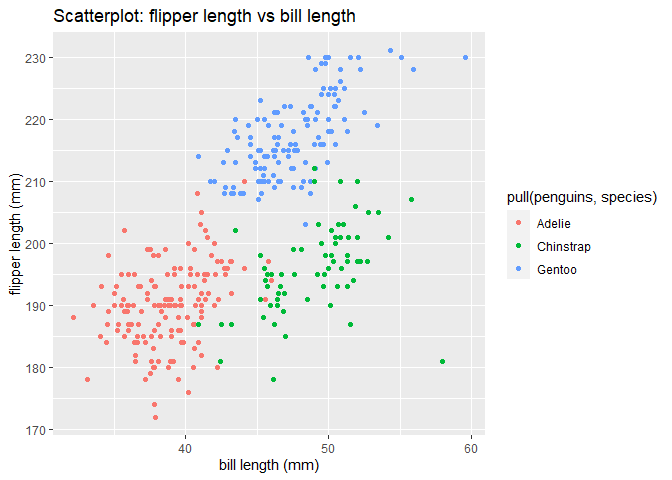

Homework 1
================
Purnima Sharma
9/15/2020

Solutions to HW1.

``` r
library(tidyverse)
```

    ## -- Attaching packages ----------------------------- tidyverse 1.3.0 --

    ## v ggplot2 3.3.2     v purrr   0.3.4
    ## v tibble  3.0.3     v dplyr   1.0.2
    ## v tidyr   1.1.2     v stringr 1.4.0
    ## v readr   1.3.1     v forcats 0.5.0

    ## -- Conflicts -------------------------------- tidyverse_conflicts() --
    ## x dplyr::filter() masks stats::filter()
    ## x dplyr::lag()    masks stats::lag()

## Problem 1

Create a data frame with specified elements.

``` r
Prob1_df = 
 tibble(
   samp = rnorm(10),
   samp_gt_0 = samp > 0,
   char_vec = c("a", "b", "c", "d", "e", "f" ,"g", "h", "i", "j"),
   factor_vec = factor(c("low", "low", "low", "mod", "mod", "mod", "mod",   "high", "high", "high"))
)
```

Take the mean of each variable in my data frame.

``` r
mean(pull(Prob1_df, samp))
```

    ## [1] -0.8642582

``` r
mean(pull(Prob1_df, samp_gt_0))
```

    ## [1] 0.3

``` r
mean(pull(Prob1_df, char_vec))
```

    ## Warning in mean.default(pull(Prob1_df, char_vec)): argument is not numeric or
    ## logical: returning NA

    ## [1] NA

``` r
mean(pull(Prob1_df, factor_vec))
```

    ## Warning in mean.default(pull(Prob1_df, factor_vec)): argument is not numeric or
    ## logical: returning NA

    ## [1] NA

I can take the mean of numbers and logical variables but not character
or factor variables.

``` r
as.numeric(pull(Prob1_df, samp))
```

    ##  [1] -1.7890322 -1.4794881 -2.2382045 -1.4530673  0.5945892 -0.5603053
    ##  [7]  0.5961614 -1.7965826 -0.7044084  0.1877561

``` r
as.numeric(pull(Prob1_df, samp_gt_0))
```

    ##  [1] 0 0 0 0 1 0 1 0 0 1

``` r
as.numeric(pull(Prob1_df, char_vec))
```

    ## Warning: NAs introduced by coercion

    ##  [1] NA NA NA NA NA NA NA NA NA NA

``` r
as.numeric(pull(Prob1_df, factor_vec))
```

    ##  [1] 2 2 2 3 3 3 3 1 1 1

Logical variable is converted to binary code of 0 and 1, conversion does
not work for character, and factor gets converted. Explains why
character has no mean.

converting logical vector to numeric, and multiplying numeric by the
result

``` r
as.numeric(pull(Prob1_df, samp_gt_0)) * pull(Prob1_df, samp)
```

    ##  [1] 0.0000000 0.0000000 0.0000000 0.0000000 0.5945892 0.0000000 0.5961614
    ##  [8] 0.0000000 0.0000000 0.1877561

converting logical vector to factor, and multiplying numeric by the
result

``` r
as.factor(pull(Prob1_df, samp_gt_0)) * pull(Prob1_df, samp)
```

    ## Warning in Ops.factor(as.factor(pull(Prob1_df, samp_gt_0)), pull(Prob1_df, : '*'
    ## not meaningful for factors

    ##  [1] NA NA NA NA NA NA NA NA NA NA

Not a possible operation.

converting logical to factor, and the result to numeric, and multiplying
numeric by the result

``` r
as.numeric(as.factor(pull(Prob1_df, samp_gt_0))) * pull(Prob1_df, samp)
```

    ##  [1] -1.7890322 -1.4794881 -2.2382045 -1.4530673  1.1891784 -0.5603053
    ##  [7]  1.1923228 -1.7965826 -0.7044084  0.3755123

End problem 1.

## Problem 2

Create a scatterplot to check behavior of ggplots for variables of
different types, using Penguins dataset.

First we load the “penguins” dataset.

``` r
data("penguins", package = "palmerpenguins")
```

### Data description

The dataset consists of information on penguins based on 8 variables.

    ```r
    names(penguins)
    ```
    
    ```
    ## [1] "species"           "island"            "bill_length_mm"   
    ## [4] "bill_depth_mm"     "flipper_length_mm" "body_mass_g"      
    ## [7] "sex"               "year"
    ```

1.  *Species* is a variable of type factor, with values of Adelie,
    Gentoo, Chinstrap.
2.  *Island* is a variable of type factor, with values of Torgersen,
    Biscoe, Dream.
3.  *Bill\_length\_mm* is a variable of type numeric.
4.  *Bill\_depth\_mm* is a variable of type numeric.
5.  *Flipper\_length\_mm* is a variable of type integer.
6.  *Body\_mass\_g* is a variable of type integer.
7.  *Sex* is a variable of type factor.
8.  *Year* is a variable of type integer, with values of 2007, 2008,
    2009.

The data frame has 344 rows and 8 columns.

The mean flipper length is 201 mm.

### Data visuals

Code chunk for Scatterplot of flipper\_length vs bill\_length, using the
“species” variable.

``` r
plot_df = tibble(
   x = pull(penguins, bill_length_mm),
   y = pull(penguins, flipper_length_mm)
)

ggplot(plot_df, aes(x = x, 
                    y = y, 
                    color = pull(penguins, species))) + geom_point() + labs(title = "Scatterplot: flipper length vs bill length", x = "bill length (mm)", y = "flipper length (mm)")
```

    ## Warning: Removed 2 rows containing missing values (geom_point).

<!-- -->

``` r
ggsave("HW1_scatterplot.pdf", height = 4, width = 6)  
```

    ## Warning: Removed 2 rows containing missing values (geom_point).

End problem 2.
